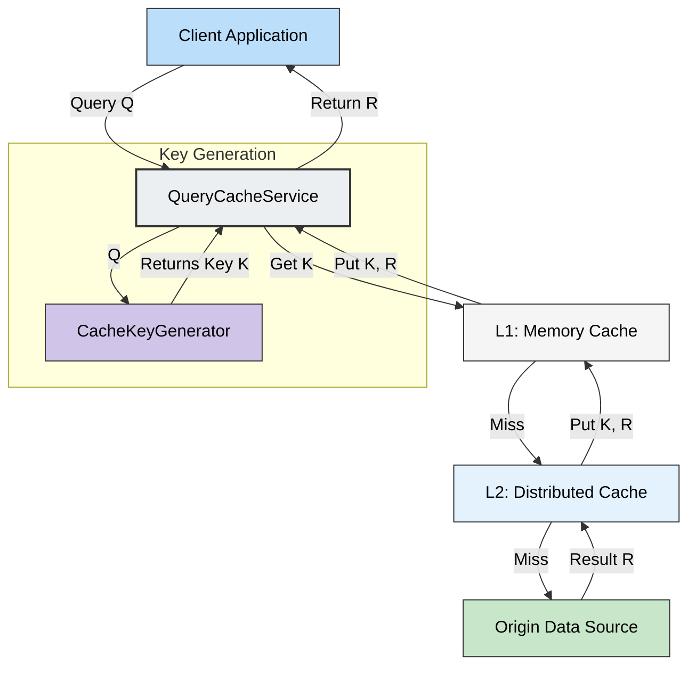
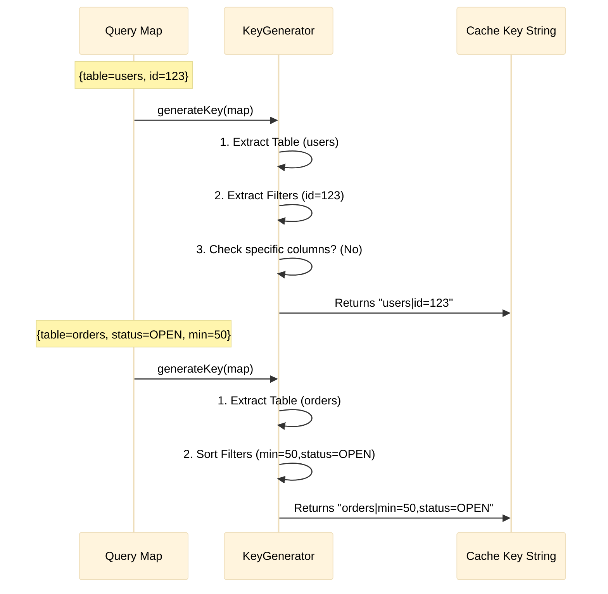

# Multi-Layer Query Cache

A robust, generic caching library for Java applications designed to handle complex query objects (Maps, SQL, etc.) with flexible caching strategies and human-readable keys.

## Features

-   **Multi-Layer Architecture**: Chain multiple cache layers (Memory, Redis, Disk) before hitting the origin.
-   **Generic Design**: Works with any Query type (`Q`) and any Result type (`R`).
-   **Compact, Reversible Keys**: Generates EDI-style positional keys (e.g., `users|id=123`) that are readable and can be parsed back into the original query.
-   **Resilience**: Supports fallback data sources and read-repair (populating L1 from L2).

## Architecture

The system follows a Chain of Responsibility pattern managed by the `QueryCacheService`.



## Compact Key Strategy (EDI-Style)

The default `EdiStyleKeyGenerator` prevents cache pollution and ensures readability by creating keys that are **Compact**, **Positional**, and **Deterministic**.

**Format:** `TABLE | FILTERS | OPTIONAL_COLUMNS`



## Usage

### 1. Define Dependencies

```java
// 1. Origin Source
DataSource<Map<String, Object>, String> origin = new MyDatabaseSource();

// 2. Cache Layers
CacheLayer<String, String> memoryCache = new InMemoryCacheLayer<>("L1");

// 3. Key Generator
CacheKeyGenerator keyGen = new EdiStyleKeyGenerator();
```

### 2. Initialize Service

```java
DataSource<Map<String, Object>, String> cacheService = 
    new QueryCacheService<>(origin, List.of(memoryCache), (CacheKeyGenerator) keyGen);
```

### 3. query

```java
Map<String, Object> query = Map.of(
    "table", "users",
    "id", 123
);

String result = cacheService.query(query);
// Key generated: "users|id=123"
```
